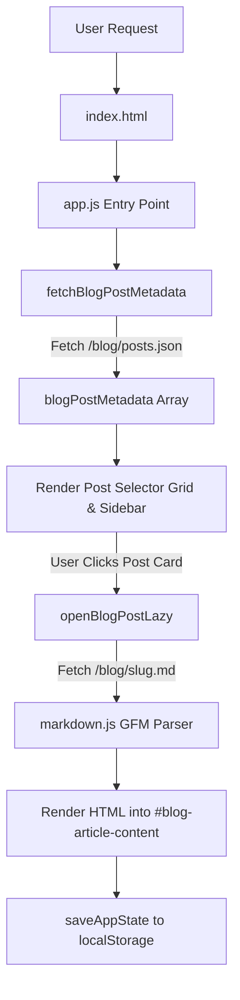

# Project Overview

`pubicStaticBlog` is a lightweight, zero-dependency Single Page Application (SPA) static blog
platform built purely with vanilla JavaScript (ES6+), HTML5, and CSS3. Designed for maximum speed
and simplicity, it requires no backend framework, build pipeline, or database—rendering Markdown
posts dynamically via manifest-driven lazy loading, cursor prefetching, custom GFM parsing, and
`localStorage` state persistence.

## Repository Structure

* `blog/`: Holds post manifest `posts.json`, raw Markdown posts, and Bible verse JSON data.
* `js/`: Contains modular ES6 IIFE JavaScript modules for rendering, navigation, and state.
* `media/`: Stores static images including background images, logos, and circle favicons.

Top-level files:
* `index.html`: Main HTML entry point defining SPA section containers and script loading order.
* `style.css`: Global design system, GNOME Adwaita dark/light themes, and CSS custom variables.
* `warning.js`: Flashing lights warning consent modal overlay and user interaction listeners.
* `sw.js`: Service Worker for static asset caching, offline support, and background prefetching.
* `README.md`: High-level project summary, features, and deployment overview.
* `LICENSE`: GNU General Public License v3.0 (`GPL-3.0`) legal text.

## Build & Development Commands

This project uses native browser features with no transpilation or bundler step required.

1. **Install Dependencies**
   No package installation required.
   ```bash
   git clone https://github.com/mikaaeru/pubicStaticBlog.git
   ```

2. **Run Local Development Server**
   Serve the repository root using any static HTTP file server:
   ```bash
   python3 -m http.server 8000
   ```
   Or using Node.js:
   ```bash
   npx serve .
   ```

3. **Validate JavaScript Syntax**
   Verify all JS modules compile without syntax errors:
   ```bash
   node -c js/*.js warning.js
   ```

4. **Lint & Type-Check**
   > TODO: No linter (ESLint) or TypeScript type-checker configured in this repository.

5. **Deploy to Production**
   Deploy repository contents directly to static hosts (Netlify, Vercel, Cloudflare Pages, S3).

## Code Style & Conventions

1. **Module Pattern**: Wrap JavaScript files in Immediately Invoked Function Expressions (IIFE)
   to prevent global namespace pollution:
   ```javascript
   (function() {
       'use strict';
       // module implementation
   })();
   ```

2. **Global Export Pattern**: Attach cross-module functions explicitly to `window`:
   ```javascript
   window.openBlogPostLazy = openBlogPostLazy;
   ```

3. **Naming Conventions**:
   * Functions and variables: `camelCase` (e.g., `fetchBlogPostMetadata`).
   * Constants: `UPPER_SNAKE_CASE` (e.g., `STATE_STORAGE_KEY`).
   * CSS classes & HTML IDs: `kebab-case` (e.g., `blog-article-content`).
   * Post file slugs: `kebab-case` (e.g., `michelle-dns-for-ios-sideloading.md`).

4. **Formatting**:
   * Use 4 spaces for JavaScript indentation.
   * Use 2 or 4 spaces for HTML and CSS indentation.
   * Avoid long inline HTML strings inside JS without template literals.

5. **Linting Configuration**:
   > TODO: Add ESLint or Prettier configuration file if automated code formatting is needed.

6. **Commit-Message Template**:
   > TODO: Define standardized commit message convention (e.g., Conventional Commits).

## Architecture Notes

### High-Level Data Flow



### Major Components

1. **Core Module (`js/app.js`)**: Coordinates application startup upon `DOMContentLoaded`.
2. **Blog Engine (`js/blog.js`)**: Fetches post metadata, manages cache (`Map`), and lazily loads
   full Markdown content on click or cursor hover prefetch.
3. **Markdown Parser (`js/markdown.js`)**: Custom zero-dependency GFM-compatible block and inline
   parser supporting code fences, tables, autolinks, task lists, and frontmatter.
4. **State Persistence (`js/state.js`)**: Persists active page, selected blog post, sidebar state,
   and theme preference to `localStorage['blogPlatformState']`.
5. **UI & Navigation (`js/ui.js`)**: Manages SPA section toggling, particle background, logo
   effects, and system auto/dark/light GNOME Adwaita theme switching.
6. **Mobile Tray (`js/mobile-tray.js`)**: Responsive navigation drawer for viewports <= 768px.
7. **Devotional (`js/devotional.js`)**: Lazy loads compact Bible verse dataset (`nt_verses_compact.json`)
   and executes requestAnimationFrame typing animations upon consent clearance.
8. **Lazy Loading (`js/lazyload.js`)**: IntersectionObserver + hover-based image lazy loading.
9. **Home Page (`js/home.js`)**: Renders blog buttons (Michelle DNS, Privacy Policy, My Blog, Monitoring)
   and legacy home page functions.
10. **Warning System (`warning.js`)**: Flashing lights consent overlay with localStorage persistence.
11. **Service Worker (`sw.js`)**: Static asset caching with multiple strategies (cache-first,
    network-first, stale-while-revalidate), offline fallback, background prefetching of
    background images and blog content via postMessage, and periodic cache cleanup.

### Module Load Order (from index.html)
```
1. markdown.js   - GFM parser (no dependencies)
2. lazyload.js   - Image lazy loading (no dependencies)
3. state.js      - State persistence (no dependencies)
4. devotional.js - Bible verses + typing animations (no dependencies)
5. ui.js         - Navigation, themes, particles (depends on markdown, state)
6. blog.js       - Blog engine, lazy loading, rendering (depends on markdown, state, ui)
7. home.js       - Home page blog buttons (depends on blog, ui)
8. mobile-tray.js - Mobile navigation (independent, loads without defer)
9. warning.js    - Consent overlay (independent, loads without defer)
10. app.js       - Entry point (depends on all above)
```

## Testing Strategy

1. **Local Syntax Checking**
   Run syntax validation across all script files before pushing changes:
   ```bash
   node -c js/*.js warning.js
   ```

2. **Automated Unit Testing**
   > TODO: Configure unit testing framework (e.g., Vitest or Jest) to test `parseMarkdown()`.

## Agent Guardrails

1. **Protected Files**: Do not modify `LICENSE` or alter `blog/posts.json` schema without
   explicit user instruction.
2. **DOM Component Contracts**: Retain critical element IDs expected across JavaScript modules:
   * `#blog-intro-view`, `#blog-post-view`, `#blog-article-content`
   * `#post-selector-list`, `#blog-post-selector-grid`, `#blog-buttons-container`
   * `#particles`, `#sidebar`, `#sidebar-toggle`, `#consent-overlay`
   * `#home-hero-content`, `#home`, `#blogs`, `#about`
   * `#mobile-nav-tray`, `#mobile-tray-overlay`, `#mobile-tray-toggle`
3. **Asynchronous Lazy Loading**: Always preserve lazy loading mechanisms (`openBlogPostLazy`,
   `preloadBlogPostContent`, `initializeLazyLoading`) over synchronous eager loading.
4. **Mandatory Post-Edit Verification**: Always run `node -c js/*.js warning.js` after modifying
   any JavaScript file to ensure syntactical validity.
5. **Module Dependencies**: Respect the load order in `index.html` - modules loaded earlier
   cannot depend on modules loaded later.

## Extensibility Hooks

1. **Adding Blog Posts**:
   1. Place the new Markdown file inside the `blog/` folder.
   2. Append a metadata entry to `blog/posts.json`:
      ```json
      {
        "id": "post-id",
        "slug": "/blog/post-id.md",
        "title": "Post Title",
        "date": "Month DD YYYY",
        "category": "Category",
        "icon": "📄"
      }
      ```

2. **Theme Customization**: Modify CSS variables in `ui.js` (`applyTheme`) and `style.css` to add
   or tweak color tokens.

3. **Event System**: Listen to custom DOM events such as `warning:cleared` dispatched by `warning.js`:
   ```javascript
   document.addEventListener('warning:cleared', () => { ... });
   ```

4. **Environment Variables**:
   > TODO: Configure build-time environment variable support if dynamic deployment APIs are required.

## Further Reading

* [README.md](file:///Users/misel/pubicStaticBlog/README.md) – Project technical details and demo.
* [LICENSE](file:///Users/misel/pubicStaticBlog/LICENSE) – GNU General Public License v3.0 text.
* [blog/posts.json](file:///Users/misel/pubicStaticBlog/blog/posts.json) – Blog post manifest catalog.