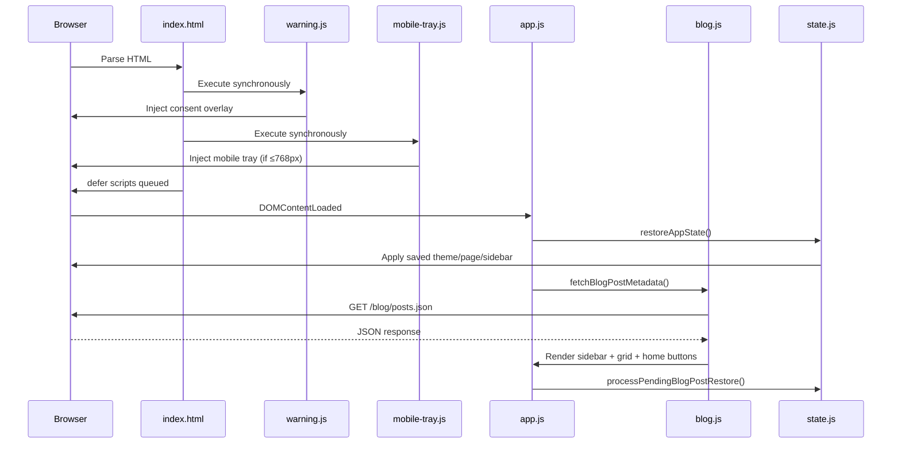
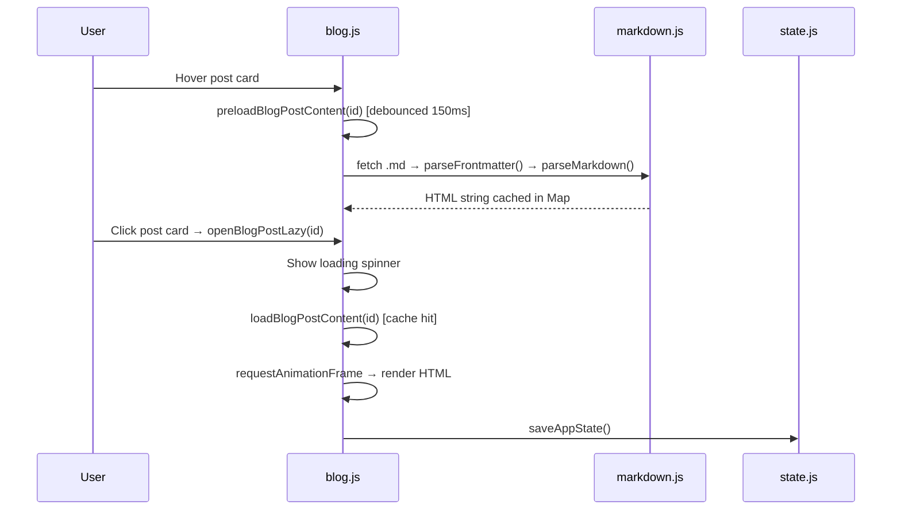

# Architecture Document — pubicStaticBlog

This document describes the internal architecture of the pubicStaticBlog SPA in detail,
covering module responsibilities, data flow, script loading, state management, and
cross-module communication patterns.

---

## 1. System Overview

pubicStaticBlog is a fully client-side static blog rendered in the browser. There is no
server-side logic, no build step, and no npm dependencies. The entire application loads
from a set of HTML, CSS, and vanilla JavaScript files served by any static file host.

**Core design principles:**

- **Zero-dependency**: No npm packages, no bundler, no transpiler.
- **Lazy by default**: Blog post content is fetched only on click or cursor hover.
- **State-resilient**: The active page, theme, sidebar, and open post survive page refresh
  via `localStorage`.
- **Progressive enhancement**: The consent overlay, devotional animation, and mobile tray
  are additive layers that degrade gracefully if their DOM targets are missing.

---

## 2. Script Loading Order

Scripts are loaded via `index.html` in a precise dependency order. Two loading strategies
coexist:

| Script | Attribute | Rationale |
|---|---|---|
| `js/markdown.js` | `defer` | Must be available before any post content is parsed. |
| `js/lazyload.js` | `defer` | Image lazy-loading hooks used by blog and markdown. |
| `js/state.js` | `defer` | State save/restore must exist before app.js runs. |
| `js/devotional.js` | `defer` | Bible verse animation, triggered after consent. |
| `js/ui.js` | `defer` | Navigation, themes, sidebar, particles. |
| `js/blog.js` | `defer` | Blog metadata fetching, post rendering, caching. |
| `js/home.js` | `defer` | Home page button rendering. |
| `warning.js` | (none) | Runs synchronously — injects consent overlay immediately. |
| `js/mobile-tray.js` | (none) | Runs synchronously — creates mobile UI on load. |
| `js/app.js` | `defer` | Entry point — orchestrates all `DOMContentLoaded` setup. |

**Why two strategies?** The `defer` scripts execute in document order after HTML parsing.
`warning.js` and `mobile-tray.js` run synchronously because they inject DOM elements
(consent overlay, mobile toggle) that must exist before `DOMContentLoaded` fires.

---

## 3. Module Responsibilities

### 3.1 `js/app.js` — Orchestrator

The entry point. Listens for `DOMContentLoaded` and calls setup functions from other
modules in sequence:

1. `createParticles()` — background visual effect.
2. `setupNavigation()` — SPA page switching.
3. `setupTemplates()` — theme button listeners + apply saved theme.
4. `setupSystemThemeListener()` — react to OS dark/light changes.
5. `setupSidebarToggle()` — collapse/expand sidebar.
6. `setupStatePersistence()` — auto-save on interactive clicks.
7. `monitorWarningAndStartDevotional()` — watch for consent clearance.
8. `restoreAppState()` — apply saved page/post/theme from `localStorage`.
9. `fetchBlogPostMetadata()` — load `posts.json`, then render sidebar, home buttons,
   post grid, and process any pending post restore.

All function calls are guarded with `typeof window.fn === 'function'` checks so the app
degrades gracefully if any module fails to load.

### 3.2 `js/blog.js` — Blog Engine

**State:**
- `window.blogPostMetadata` — array of post metadata objects (no content).
- `blogContentCache` — internal `Map` keyed by post ID, caching loaded HTML.

**Key functions:**
- `fetchBlogPostMetadata()` — fetches `/blog/posts.json`, sorts by date descending.
- `loadBlogPostContent(postId)` — fetches the `.md` file, parses frontmatter + markdown,
  caches the result.
- `preloadBlogPostContent(postId)` — debounced (150ms) hover prefetch.
- `openBlogPostLazy(id)` — shows loading spinner, awaits content, renders with
  `requestAnimationFrame`, saves state.
- `goBack()` — pops navigation history stack, restores previous view.
- `showBlogIntro()` — returns to the post selector grid.

**Navigation history:** An internal `navigationHistory` array tracks page transitions so
the back button can restore the exact previous state (home, about, blog-intro, or a
specific post ID).

### 3.3 `js/markdown.js` — GFM Parser

A fully custom, zero-dependency Markdown-to-HTML parser implementing the GitHub Flavored
Markdown (GFM) specification. Architecture is split into two phases:

1. **Block parsing** (`parseBlocks`) — scans lines top-to-bottom, emitting typed block
   nodes: headings, code fences, blockquotes, lists (with nested recursion), tables,
   thematic breaks, HTML blocks, paragraphs.
2. **Inline parsing** (`parseInline`) — character-by-character scan within each block's
   text content: code spans, images, links, autolinks, extended autolinks, emphasis/strong,
   strikethrough, hard breaks.

Additional utilities:
- `parseFrontmatter(content)` — splits YAML frontmatter from body content.
- `escapeHtml(text)` — sanitizes `&`, `<`, `>`, `"` to prevent XSS.

Exports work in both browser (`window`) and Node.js (`module.exports`) environments.

### 3.4 `js/state.js` — State Persistence

Saves and restores application state to `localStorage` under the key
`blogPlatformState`. The state object contains:

```
{
  currentPage: "home" | "blogs" | "about",
  activeBlogPost: "post-id" | null,
  sidebarCollapsed: boolean,
  theme: "auto" | "light" | "dark",
  blogIntroViewed: boolean,
  timestamp: number
}
```

**Deferred restoration:** When restoring a blog post, `state.js` sets
`window.pendingBlogPostRestore` and lets `app.js` process it after
`fetchBlogPostMetadata()` resolves, avoiding a race condition.

### 3.5 `js/ui.js` — UI & Navigation

- **SPA routing**: Click handlers on `.nav-item` elements toggle `.page-section.active`.
- **Blog nav logic**: First click on "Blogs" from Home/About restores a saved post;
  second click shows the post grid. Clicking "Blogs" while reading a post also shows
  the grid.
- **Theme engine**: Three themes (auto, light, dark) implemented by setting CSS custom
  properties on `document.documentElement`. Auto delegates to light/dark based on
  `prefers-color-scheme`.
- **Theme persistence**: Uses cookies (`theme_preference`, 365-day expiry).
- **Particles**: Creates 20 floating `div.particle` elements (skipped if
  `prefers-reduced-motion: reduce`).
- **Sidebar**: Toggle between collapsed/expanded. Auto-collapses on mobile resize.

### 3.6 `js/home.js` — Home Page

- `renderBlogButtonsLazy(posts)` — creates styled link buttons for featured posts
  (Michelle DNS, Privacy Policy) plus external links (cat pictures, monitoring) and
  an internal "My Blog" nav link.
- `openBlogPostFromHomeLazy(id)` — navigates to blogs page, then opens the post.

### 3.7 `js/devotional.js` — Bible Verses

- Loads `/blog/nt_verses_compact.json` on-demand (compact `[book, ch, verse, text]`
  array format).
- Selects a random verse under 150 characters.
- Plays a delete-then-type animation on the `.home-lead` paragraph using
  `requestAnimationFrame`.
- Triggered by the `warning:cleared` custom event or by detecting prior consent in
  `localStorage`.

### 3.8 `js/lazyload.js` — Image Lazy Loading

- `initializeLazyLoading()` — finds all `img.lazy-image[data-src]` elements.
- Loads on hover (`mouseenter`) and as fallback via `IntersectionObserver` (50px margin).
- Preloads via a hidden `Image()` object to avoid layout shift.

### 3.9 `js/mobile-tray.js` — Mobile Navigation

- Creates a slide-in drawer (`#mobile-nav-tray`) for screens ≤ 768px.
- Contains: post list, theme buttons.
- Syncs theme state bidirectionally with the desktop sidebar.
- Auto-creates/destroys on window resize.
- Polls for `window.blogPostMetadata` availability (100ms intervals, 5s timeout).

### 3.10 `warning.js` — Consent Overlay

- Injects a full-screen blurred overlay with ACCEPT/DECLINE buttons.
- On ACCEPT: stores consent in `localStorage['system_warning_consent']`, dispatches
  `warning:cleared` custom event, fades out overlay.
- On DECLINE: triggers rapid flash warnings for 3 seconds, then reloads.
- Click/keydown/touch triggers a flash effect (purple overlay with random phrase) on
  non-interactive elements.
- `beforeunload` handler prompts "Are you sure?" unless the click was on a recognized
  interactive element.

---

## 4. Cross-Module Communication

Modules communicate exclusively through:

1. **`window` globals** — functions and state arrays attached to `window`.
2. **DOM element IDs** — modules query shared elements by ID (see Agent Guardrails in
   AGENTS.md for the protected ID list).
3. **Custom events** — `warning:cleared` dispatched by `warning.js`, consumed by
   `devotional.js`.
4. **`localStorage`** — `blogPlatformState` (state.js) and `system_warning_consent`
   (warning.js).
5. **Cookies** — `theme_preference` (ui.js).

There is no event bus, pub/sub system, or module bundler. Dependencies are implicit
through script loading order.

---

## 5. Data Flow Diagrams

### 5.1 Page Load Sequence



### 5.2 Post Open Sequence



---

## 6. Key Design Decisions

Detailed rationale for major decisions is tracked in `docs/ADR/`. Summary:

| Decision | Choice | Rationale |
|---|---|---|
| No build step | Vanilla JS + IIFE | Eliminates tooling complexity, deploys anywhere. |
| Custom markdown parser | Zero-dependency GFM parser | Avoids bundling marked/remark (~30KB+). |
| Lazy content loading | Fetch on click, prefetch on hover | Reduces initial payload to ~2KB manifest. |
| localStorage state | JSON blob in single key | Simple, synchronous, no server needed. |
| Cookie for theme | 365-day cookie | Survives `localStorage` clearing. |
| Consent overlay | Synchronous injection | Must block interaction before DOM is ready. |

---

## 7. Performance Characteristics

- **Initial load**: Only `posts.json` (~2KB) is fetched. Post content stays unfetched.
- **Hover prefetch**: 150ms debounce prevents thrashing during rapid mouse movement.
- **Content cache**: `Map`-based cache means each post is fetched at most once per session.
- **Particles**: Skipped entirely under `prefers-reduced-motion: reduce`.
- **Images**: Lazy-loaded via `IntersectionObserver` + hover trigger with preload `Image()`.
